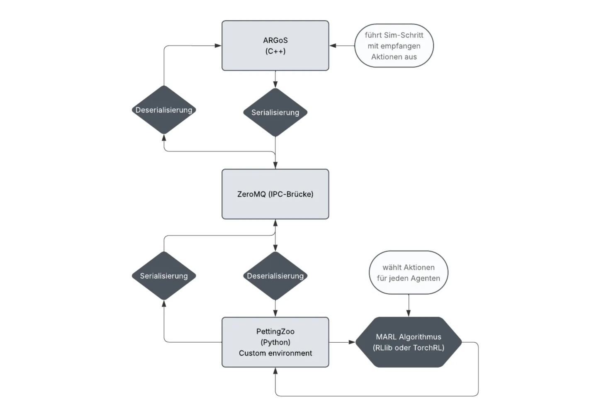

# ArgosToZoo

[**Concept**](#concept) | [**How to Run**](#how-to-run) | [**Milestones**](#project-management) | [**Resources**](#resources)

**ArgosToZoo** bridges the high-performance ARGoS simulator with popular Multi-Agent Reinforcement Learning (MARL) libraries. It enables the seamless integration of complex swarm robotics experiments into modern Python-based RL workflows.

## Overview

- 🚀 **Project Goal:** To create a robust bridge for controlling ARGoS agents using an external Python policy, with the ultimate aim of simulating collective behaviors (e.g., collective transport) trained with MARL.
- 🏎️ **Architecture:** Decoupled client–server with a *single* ZeroMQ REP socket hosted by the ARGoS loop functions (central server). Python (`ArgosEnv` PettingZoo wrapper) is the single REQ client sending batched actions and receiving batched observations for all robots every simulation tick. High‑performance physics stays in C++; flexible policy logic lives in Python.

## Tech Stack

- 🤖 **ARGoS (C++):** Simulates the environment and the physics of the agents.
- 🛜 **ZeroMQ (C++ & Python):** Handles high-performance, low-latency message passing between the C++ simulator and the Python controller via the REQ/REP pattern.
- 📄 **nlohmann/json (C++):** A lightweight, header-only library for serializing and deserializing data sent over the ZeroMQ bridge.
- 🧠 **PettingZoo (Python):** The target framework for wrapping the simulation environment to make it compatible with standard MARL algorithms.

## Concept

### Current Data / Control Flow (Unified Batched Socket)

1. **Central Server (ARGoS Loop Functions):** A single REP socket (default `tcp://*:5555`) lives in the loop functions plugin. Each tick it: (a) advances simulation, (b) gathers observations from all controllers, (c) computes rewards, then blocks waiting for the next Python request.
2. **Python Client (`ArgosEnv`):** Maintains one REQ socket. Each `step()` call sends a JSON payload containing a per‑agent action map.
3. **Action Application:** Actions received in tick *T* are applied at the start of tick *T+1* (standard synchronous environment semantics).
4. **Observation + Reward Collection:** After physics + controller updates, the server collects proximity sensor arrays, positions, and calculates shaped rewards.
5. **Batched Reply:** A single JSON message with a compact schema (see below) is sent back to Python.
6. **Loop:** Python decodes to per‑agent observations; policies pick the next actions.

This design (FUP‑09 option A) replaces earlier per‑robot socket plans. It minimizes connection management overhead, enables scaling to dozens of robots with constant socket count, and reduces marshaling cost by packing homogeneous arrays.



### Observation & Reward Schema

The simulator always returns the unified compact schema (`compact_v1`):

```jsonc
{
    "observations": {
        "schema": "compact_v1",
        "agents": ["robot_0", "robot_1"],
        "proximity": [
            [0.0, 0.02, ... 24 values ...],
            [0.01, 0.00, ...]
        ],
        "position": [
            [x0, y0, z0],
            [x1, y1, z1]
        ],
        "rewards": {
            "robot_0": 0.0,
            "robot_1": 0.0
        }
    }
}
```

Python normalizes this into a per‑agent dict with only the fields exposed in the declared observation space (currently proximity readings). Positions are reserved for future tasks (e.g., navigation shaping, curriculum signals).

**Reward shaping (FUP‑05):**

```
reward_i = distance_xy_moved_since_last_step_i - 0.5 * max_proximity_reading_i
```

The first post‑reset step produces 0.0 for all agents (baseline). This shaping encourages exploration while discouraging close proximity (e.g., collisions / crowding) reflected by high proximity sensor values.

### Rationale for Compact Batched Format

| Concern | Prior (per‑agent JSON objects) | Now (compact arrays) |
|---------|--------------------------------|----------------------|
| Message overhead | Repeated keys per agent | Single header, dense arrays |
| Socket management | One socket per robot | Single socket |
| Latency scaling | O(N) round‑trips | O(1) per tick |
| Schema evolution | Hard (need cross‑agent consistency) | Centralized version gating (`schema`) |

Future extensions (e.g., adding battery, IMU, task-specific signals) append new parallel arrays without breaking existing consumers that key off `schema`.

## How to Run

These instructions are for macOS (Apple Silicon/ARM64).

### 1. Install Dependencies

**Core Dependencies (via Homebrew):**
```bash
brew install pkg-config cmake libpng freeimage qt freeglut lua docbook asciidoc graphviz doxygen zeromq cppzmq clang-format
```

**Python Packages:**
```bash
pip install -r requirements.txt
```

**C++ JSON Library:**
1. Download `json.hpp` from the [nlohmann/json releases](https://github.com/nlohmann/json/releases).
2. Create directory `plugin/common/`.
3. Place `json.hpp` in `plugin/common/`.

### 2. Compile the Plugin

Run all commands from the project root (`ArgosToZoo/`):
```bash
rm -rf build              # (Optional) Clean previous builds
mkdir build && cd build   # Create and enter build directory
cmake ..                  # Configure project
make                      # Compile the C++ controller plugin
```
The compiled library `libmy_ipc_controller.dylib` will be in `build/controllers/`.

### 3. Quick Interactive Check (PettingZoo Wrapper)

Python smoke interaction after build:

```bash
PYTHONPATH=src python - <<'PY'
from zoo.argos_env import ArgosEnv
env = ArgosEnv("experiments/footbot_5.argos", loop_log_level="WARN", controller_log_level="ERROR")
obs, info = env.reset(seed=0)
for _ in range(3):
    actions = {a:0 for a in env.agents}  # all 'stop'
    obs, rew, term, trunc, info = env.step(actions)
    print({a: float(rew[a]) for a in rew})
env.close()
PY
```

## Testing

The automated test suite (FUP-11) validates:

| Area | Purpose |
|------|---------|
| API compliance | PettingZoo parallel API structure & lifecycle |
| Reward variance | Ensures non-constant shaping signal (compact schema rewards field) |
| Seeding | Deterministic restart & simulator re-seed logic |
| Timeout recovery | Socket resilience (ZeroMQ reconnection) |
| Graceful shutdown | Idempotent `close()` & process cleanup |

Full local run (all available tests):
```bash
pytest -q
```

Fast logic-only selection (skips named integration-style tests):
```bash
pytest -k "not timeout and not graceful" -q
```

PettingZoo API smoke check (manual):
```bash
python -m pettingzoo.test.parallel_api_test zoo.argos_env:ArgosEnv
```

Style-only lint (Python sources only):
```bash
flake8 src/zoo
```

CI mapping (`.github/workflows/ci.yml`):
- Feature branch push → fast Python job (ARGoS-dependent tests auto-skip if binary missing).
- PR to main / push on main → full integration job builds ARGoS & runs entire suite.

## CI & Development Workflow

The CI (see `.github/workflows/ci.yml`) is optimized for quick Python feedback on feature branches and full integration guarantees on PRs/main:

| Scenario | Job | What runs | ARGoS Build | Approx Time |
|----------|-----|-----------|-------------|-------------|
| Push to feature branch | `fast-python` | flake8 (Python), pytest (all tests; ARGoS tests auto-skip if no binary) | No | ~1–2 min |
| Pull Request → `main` | `full-integration` | Brew deps, ARGoS clone + cached incremental build, C++ lint, plugin build, full pytest | Yes | ~5–7 min first run; faster with cache |
| Push to `main` | `full-integration` | Same as PR | Yes | ~5–7 min |

Caching: The ARGoS build directory (`argos3/build`) is cached. Subsequent PR runs reuse object files, cutting incremental build time. The install step always runs to ensure the `argos3` binary is on PATH.

Manual local full integration test (mirrors CI):
```bash
brew install pkg-config cmake libpng freeimage qt freeglut lua docbook asciidoc graphviz doxygen zeromq cppzmq clang-format
git clone https://github.com/ilpincy/argos3.git
cd argos3 && mkdir build && cd build
cmake -DCMAKE_CXX_STANDARD=17 ../src && make -j$(sysctl -n hw.ncpu) && make doc && sudo make install
cd ../../
pip install -r requirements.txt
pytest -q
```

Troubleshooting CI:
- ARGoS not found: Check the log section "Build & Install ARGoS" and confirm `argos3 -q version` output.
- Cache not used: Ensure cache key hasn't changed (CMakeLists modifications re-trigger full compile).
- Failing C++ lint: Run `clang-format -i` locally on `src/plugin/**/*.cpp` & `*.h`.
- Skipped integration tests in `fast-python`: This is expected; they re-run fully in the PR job.

Contribution Guidelines (short):
1. Create feature branch: `git checkout -b feature/<short-name>`.
2. Write/adjust tests first (reward, seeding, recovery, shutdown).
3. Run local lint & tests: `flake8 src/zoo && pytest -q`.
4. Push (fast CI). Open PR to trigger full integration.
5. Merge only when full integration green.

## Logging (FUP-10)

Unified, minimal logging across Python + C++ with opt‑in verbosity.

### 1. Python (`SimpleLogger`)

| Feature | Details |
|---------|---------|
| Levels | `DEBUG < INFO < WARN < ERROR` |
| Formats | `text` or `json` (line delimited) |
| Timestamp | UTC ISO8601 (`...Z`) |
| Quiet mode | `quiet=True` forces ERROR regardless of `log_level` |
| Structured fields | `logger.info("step", t=42, phase="Idle")` merges into JSON / prints key=value |

Constructor excerpt:
```python
ArgosEnv(
    argos_file="experiments/footbot_5.argos",
    log_level="INFO",      # DEBUG/INFO/WARN/ERROR
    log_format="text",     # or "json"
    quiet=False,            # True => force ERROR
    controller_log_level=None,  # pass to C++ controller
    loop_log_level=None,        # pass to C++ loop functions
)
```

Examples:
```python
from zoo.argos_env import ArgosEnv

# Verbose development (Python + loop DEBUG)
env = ArgosEnv(
    "experiments/footbot_5.argos",
    log_level="DEBUG",
    loop_log_level="DEBUG",
)

# JSON structured lines
env_json = ArgosEnv(
    "experiments/footbot_5.argos",
    log_format="json",
    log_level="INFO",
)

# Ultra quiet (CI)
env_quiet = ArgosEnv(
    "experiments/footbot_5.argos",
    quiet=True,
    controller_log_level="ERROR",
    loop_log_level="ERROR",
)
```

Sample JSON record:
```json
{"ts":"2025-08-19T07:15:12.145623Z","level":"DEBUG","msg":"ZMQClient initialized","port":"5555","timeout_ms":5000}
```

### 2. C++ (Controllers & Loop Functions)

Configure via environment variables (evaluated at simulator start):

| Component | Env Var | Default | Notes |
|-----------|---------|---------|-------|
| Controller (per robot) | `ARGOS_CONTROLLER_LOG_LEVEL` | INFO | DEBUG logs action changes + lifecycle |
| Loop Functions (global) | `ARGOS_LOOP_LOG_LEVEL` | INFO | DEBUG logs ZMQ status + payloads |

Accepted values: `DEBUG`, `INFO`, `WARN`, `ERROR` (case‑insensitive; invalid -> INFO).

Shell usage:
```bash
ARGOS_CONTROLLER_LOG_LEVEL=ERROR ARGOS_LOOP_LOG_LEVEL=DEBUG \
  argos3 -c experiments/footbot_5.argos
```

Through Python (preferred):
```python
env = ArgosEnv(
    "experiments/footbot_5.argos",
    controller_log_level="WARN",
    loop_log_level="DEBUG",
)
```

### 3. ZMQ Status Diagnostics (Loop DEBUG)

One concise line each simulation tick:
```
ZMQ status phase=PendingRequest pending=yes total_req=42 total_rep=42 idle_ticks=0
```

Fields:
| Field | Meaning |
|-------|---------|
| phase | High‑level derived state (`WaitingForFirstRequest`, `PendingRequest`, `Idle`) |
| pending | `yes` if REP socket ready (has request to answer) |
| total_req | Cumulative received requests |
| total_rep | Cumulative replies sent |
| idle_ticks | Consecutive ticks without a pending request |

### 4. Quick Recipes

Development (full detail):
```bash
PYTHONPATH=src \
ARGOS_CONTROLLER_LOG_LEVEL=DEBUG \
ARGOS_LOOP_LOG_LEVEL=DEBUG \
python tests/test_env.py -k env_smoke -s
```

Loop focus (suppress controller noise):
```bash
PYTHONPATH=src ARGOS_CONTROLLER_LOG_LEVEL=ERROR ARGOS_LOOP_LOG_LEVEL=DEBUG \
python tests/test_env.py -k env_smoke -s
```

Quiet CI:
```bash
PYTHONPATH=src ARGOS_CONTROLLER_LOG_LEVEL=ERROR ARGOS_LOOP_LOG_LEVEL=ERROR \
pytest -q
```

JSON export snippet:
```bash
PYTHONPATH=src python - <<'PY'
from zoo.argos_env import ArgosEnv
env = ArgosEnv("experiments/footbot_5.argos", log_format="json", log_level="INFO")
env.reset(seed=0)
for _ in range(5):
    env.step({a:0 for a in env.agents})
env.close()
PY
```

### 5. Edge / Error Behavior

| Scenario | Behavior |
|----------|----------|
| Bad Python `log_level` | `ValueError` on construction |
| Bad `log_format` | `ValueError` (must be `text` or `json`) |
| `quiet=True` + level supplied | Quiet wins (forces ERROR) |
| Proximity length mismatch | Warn once per occurrence; auto pad/truncate |
| Missing actions payload | Loop WARN (client lag / first tick) |

### 6. Cheat Sheet

| Goal | How |
|------|-----|
| All debug | `ArgosEnv(..., log_level="DEBUG", loop_log_level="DEBUG", controller_log_level="DEBUG")` |
| Loop only debug | `loop_log_level="DEBUG", controller_log_level="ERROR"` |
| Structured logs | `log_format="json"` |
| Maximum silence | `quiet=True` + export `ARGOS_*_LOG_LEVEL=ERROR` |
| Inspect ZMQ phases | Loop log level = `DEBUG` |

### 7. Future Extensions

Planned / possible:
* `ARGOS_ENV_LOG_LEVEL` env var for Python.
* Bridge to standard `logging` if integration needed.
* Add correlation IDs (episode/step) automatically in JSON mode.

For advanced aggregation, run JSON mode and pipe to your own processor.

## Project Management

<details>
<summary>🏁 Milestones</summary>

**M1 – Infrastructure & Prototype (≈30 h)**
- Set up ARGoS dev environment (build, plugins, scenarios)
- Implement C++ ZeroMQ skeleton (REQ/REP)
- First end-to-end message: observation → Python → acknowledgment

**M2 – Python Wrapper & PettingZoo (≈40 h)**
- Develop `ArgosEnv` according to PettingZoo Parallel API
- Map JSON to obs/reward/done dictionaries
- Unit tests for wrapper & handshake

**M3 – Benchmark Scenario & MARL (≈50 h)**
- Define collective transport task with 5 agents
- Integrate MARL algorithm (e.g., PPO via RLlib/TorchRL)
- Initial training: hyperparameters, logging, TensorBoard

**M4 – Evaluation & Documentation (≈30 h)**
- Analyze training progress & stability
- Optimize communication pipeline
- Final documentation (diagrams, protocol specs)

</details>

<details>
<summary>🌀 Agile Approach</summary>

- **Product Backlog & Stories:** Kanban board (GitHub Issues)
- **Two-Week Sprints (~25 h):** Plan, review, retrospectives
- **Definition of Done:** Code compiles, docs updated, example works, issue closed
- **Meeting Structure:** Bi-weekly reviews & weekly check-ins

</details>

## Resources

- **ARGoS:** [Modular, parallel, multi-engine simulator](https://doi.org/10.1007/s11721-012-0072-5)
- **PettingZoo Parallel API:** [Documentation](https://pettingzoo.farama.org/api/parallel/) | [Paper](https://arxiv.org/pdf/2009.14471)
- **Ray RLlib:** [RLlib Docs](https://docs.ray.io/en/latest/rllib/index.html) | [Multi-Agent](https://docs.ray.io/en/latest/rllib/multi-agent-envs.html) | [External Env](https://docs.ray.io/en/latest/rllib/external-envs.html)
- **ZeroMQ:** [Official Site](https://zeromq.org/)
- **Research:** [Swarm robotics RL overview](https://doi.org/10.1016/j.cogr.2023.07.004)
